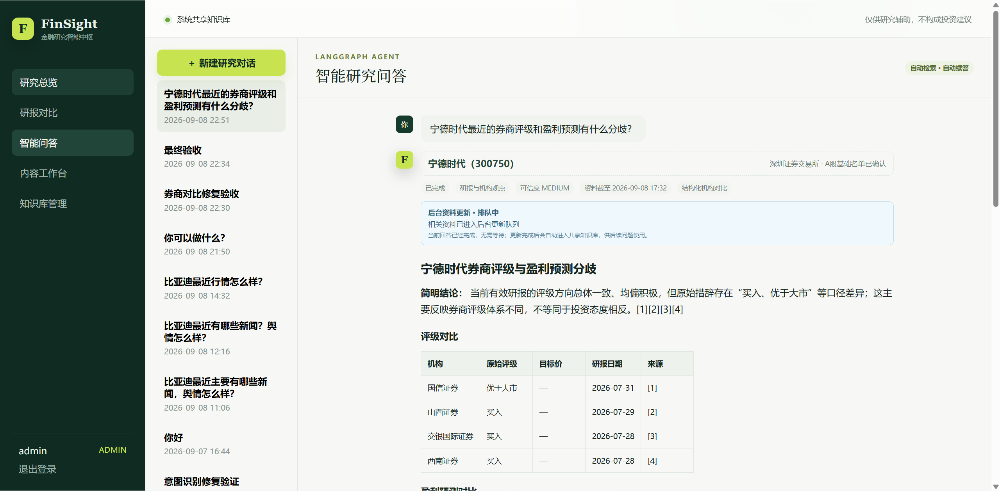
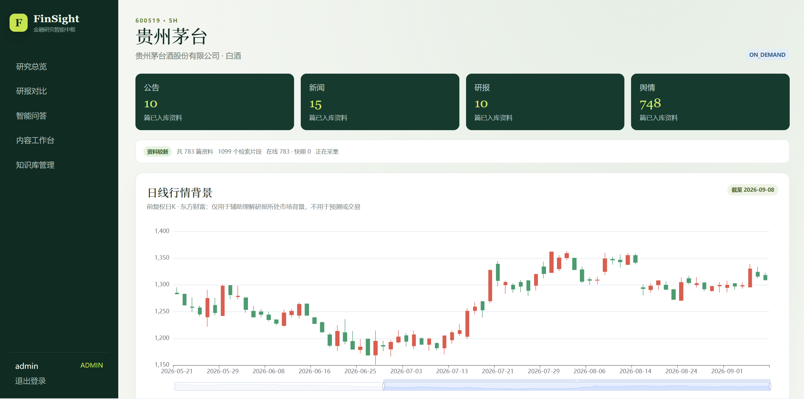

# FinSight 金融研报智能分析系统

FinSight 是一个面向课程实践的金融研究辅助系统。它自动采集A股公司的研报、新闻、公告和公开舆情，完成PDF/HTML解析、结构化信息抽取、观点与风险归纳、混合RAG检索，并通过LangGraph Agent生成带原文引用的回答和研究简报。

> 本项目只提供信息检索和研究辅助，不构成投资建议，不连接证券账户，也不会执行交易。

## 界面预览

### LangGraph智能研究问答

系统基于共享知识库检索研报证据，结构化比较券商评级与盈利预测，并为重要结论提供可追溯引用。



### 公司研究总览

公司页面聚合公告、新闻、研报和舆情，并展示资料新鲜度、日线行情背景及后续研究分析模块。



## 已实现功能

- FastAPI主业务API和Flask内部采集服务。
- MySQL 8.0系统级共享知识库。
- Redis、独立前台问答/后台AI/定时采集/首次按需采集 Celery Worker 和 Celery Beat 异步执行；会话摘要与报告生成不会再占用前台问答队列。
- 研报、新闻、公告和股吧舆情四类自动采集适配器。
- `LIVE`、`SNAPSHOT`和默认`AUTO`在线/快照模式。
- PDF分页解析、HTML正文提取、SHA-256去重和失败状态。
- 财务指标、盈利预测、评级、目标价、观点、风险及情感抽取。
- Milvus Standalone中的BGE中文稠密向量与原生BM25稀疏向量混合检索；Milvus异常时自动降级到本地FAISS/BM25。
- LangGraph有状态Agent：每轮先把当前问题与完整会话记忆交给大模型，改写为可独立理解的问题，并由模型规划研究意图、资料来源和最小工具集合；确定性规则只在模型不可用或结果无法解析时兜底。
- 公司事实走带引用的RAG，稳定金融概念可直接使用通用知识模式；已有知识先回答，过期资料按问题涉及的来源在后台增量更新，仅知识库完全为空时暂停并在首次采集后自动续答。
- 智能问答支持停止、模型降级/失败/停止后重新执行、自然澄清、歧义公司候选选择、任务超时和僵尸任务自动恢复；界面会区分知识库证据、通用知识、结构化对比和证据降级回答。
- SSE实时推送问答状态与模型正文，10秒低频轮询作为断线兜底；检测到明确推理信号后暂停首字超时且界面仅显示“正在思考”，正文到达后逐块呈现。空心跳不冒充推理，任务仍受8分钟整体硬上限及用户主动停止保护。会话内支持“它的预测呢”“比亚迪呢”等省略式追问与对象切换。
- 多轮对话使用分层持久化记忆：MySQL保存每一轮完整问答；短会话注入全部历史，长会话注入结构化摘要、最近8轮完整问答和Milvus召回的相关旧轮次。历史检索严格限定当前用户与当前会话，旧回答中的引用编号不会复用于新回答。
- `ADMIN`和`ANALYST`角色、JWT登录、个人收藏/会话/报告隔离。
- Vue 3研究首页、公司页、研报对比、智能问答、内容工作台和知识库后台；研报对比提供2～10篇精选对比和最多50篇的全量共识分析，可按机构、日期与评级筛选并默认按机构去重。
- ECharts资料构成、情感分布、机构预测、评级分布、事件聚类和前复权日K。
- 东方财富日线失败时自动降级到新浪财经；行情只用于研究背景，不用于交易。
- 内容工作台支持知识覆盖与新鲜度检查、逐篇资料选择，以及不阻塞页面的Celery后台生成；资料更新可独立在后台执行。
- 公司研究简报与多研报观点对比分别生成：前者区分财务实际值、机构预测、评级、事件、舆情和风险，后者比较评级、目标价、盈利预测、机构共识、分歧和风险差异。
- 报告支持可点击原文引用、引用可信度标识、在线Markdown编辑、自动版本记录、取消、重试、复制、软删除，以及Markdown、Word和PDF下载。
- 文档详情展示结构化评级、预测、观点、风险及对应原文证据。
- 数据源成功/失败次数、运行耗时、连续失败、在线/快照来源，以及Milvus集合健康度、向量维度和同步进度监控。

## 快速启动

### 1. 准备配置

仓库已经提供本地演示用`.env`。正式提交代码时该文件会被Git忽略，应从模板复制：

```powershell
Copy-Item .env.example .env
```

如果使用大模型，在`.env`中填写：

```dotenv
LLM_BASE_URL=https://your-provider.example/v1
LLM_API_KEY=your-api-key
LLM_MODEL=your-chat-model
```

未填写时，系统使用规则抽取和证据拼接作为可重复的演示降级，不会伪造模型答案。

问答采用“模型理解优先、规则安全兜底”的路由方式：模型结合当前问题和会话历史生成独立问题，并选择是否需要公司、知识库来源与分析工具；新闻、公告、行情、财务、评级、预测等时效性公司事实仍优先使用知识库证据。缺少必要信息时由模型自然澄清，模型不可用时才进入确定性兜底。系统会记录脱敏的模型名、首字耗时、流式事件数、正文分块数、总耗时、尝试次数和错误类型；在尚未输出正文时允许受控重试，已经输出的内容不会被重复生成。

DeepSeek V4环境下，路由与会话摘要明确使用非思考模式，最终研究回答使用`low`推理强度；避免服务端默认`high`思考给简单规划任务带来长时间首字等待，同时保留最终分析的模型推理能力。

### 2. 启动服务

启动Docker Desktop，然后在项目根目录执行：

完整模式（自动采集、定时更新、行情同步全部启用）：

```powershell
.\scripts\start.ps1
```

轻量研究模式（保留登录、页面、既有知识库问答和首次按需采集，暂停批量采集和定时任务）：

```powershell
.\scripts\start-lite.ps1
```

系统通过 FastEmbed/ONNX 运行`BAAI/bge-small-zh-v1.5`，并把向量写入Milvus。模型默认缓存到`/root/.cache/huggingface/fastembed`；API与各Worker通过Docker的`model_cache`持久卷共享这份缓存，因此只需首次下载，重建或重启容器不会重复下载。首次启用时仍建议提前运行一次；如果答辩网络不稳定，也可以临时设置：

```dotenv
ENABLE_LOCAL_EMBEDDINGS=false
```

关闭服务：

```powershell
.\scripts\stop.ps1
```

脚本使用`stop`而不是`down -v`，不会删除数据库和本地知识库数据。

不要在需要保留数据库时使用`docker compose down -v`，因为`-v`会删除数据卷。

### 3. 访问系统

- 前端：[http://localhost:5173](http://localhost:5173)
- FastAPI接口文档：[http://localhost:8000/docs](http://localhost:8000/docs)
- FastAPI健康检查：[http://localhost:8000/health](http://localhost:8000/health)
- Flask采集服务健康检查：[http://localhost:5001/health](http://localhost:5001/health)
- Milvus健康检查：[http://localhost:9091/healthz](http://localhost:9091/healthz)

演示账号：

| 角色 | 用户名 | 密码 |
|---|---|---|
| 管理员 | `admin` | `Admin123!` |
| 研究用户 | `analyst` | `Analyst123!` |

答辩前必须修改`.env`中的密钥和演示密码；用户名密码仅用于本地课程演示。

## 推荐演示流程

1. 使用管理员账号登录。
2. 进入“知识库管理”，点击“全部立即同步”。
3. 观察四类来源的任务进度、文档解析和索引状态。
4. 打开比亚迪公司页，查看K线背景、资料构成、情感、盈利预测、评级分布和聚合事件。
5. 在“研报对比”中生成多机构观点对比。
6. 在“智能问答”中询问“比亚迪最近有哪些主要风险？”。
7. 再询问非预置公司，例如“分析贵州茅台最近的机构观点”，展示按需采集和自动续答。
8. 在“内容工作台”检查知识覆盖，逐篇选择资料并生成公司研究简报；点击右侧引用核对原文，再编辑并保存一个新版本。
9. 在“多研报观点对比”中先选择2～10篇进行精选对比，再切换“全量共识”验证机构去重、盈利预测区间、共识、分歧和共同风险。
10. 切换研究用户账号，验证不能访问管理后台，且个人会话和报告相互隔离。

在同一对话中可以继续询问“它的盈利预测呢”；系统会继承上一轮公司。行业问题会跨公司检索当前共享知识库。港股、美股等非支持市场会明确说明边界，不再错误提示为缺少A股名称。

多轮记忆不是只保存用户问题：MySQL始终保存当前会话此前的完整提问和回答；模型提示词采用结构化摘要、Milvus相关旧轮次与最近4轮的分层记忆。路由阶段使用最多1200 Token的紧凑上下文，最终回答阶段使用最多2500 Token的相关上下文，旧引用编号不会复用。会话摘要由独立`ai-background-worker`维护，不阻塞前台问答；向量库只负责相关性召回，不作为唯一数据源。

问答任务通常会依次显示排队、实体识别、证据分析等状态。若公司已有知识，即使用户询问“最近/最新”，系统也会先基于现有资料完成回答，并单独显示资料截止时间和后台更新状态；新闻、舆情、公告或研报只刷新问题实际涉及的来源。只有新公司的知识库完全为空时，问题才进入 `COLLECTING`，由独立的首次采集 Worker 完成建库后自动续答。任务执行期间可以点击“停止任务”；失败或停止后可点击“重新执行”。“你是什么模型”“你能做什么”等系统问题会直接回答，不会触发公司采集。后台通过精确任务绑定、队列去重和定时巡检避免任务被错误唤醒或无限卡住。

## 自动更新规则

- `SEED`：比亚迪、宁德时代和赣锋锂业，长期自动更新。
- `PINNED`：管理员固定跟踪，长期自动更新。
- `ON_DEMAND`：用户最近7天查询过，临时自动更新。
- `INACTIVE`：停止更新但保留历史知识。
- 研报和公告每天08:00增量同步。
- 新闻和舆情每30分钟增量同步。
- 跟踪公司日线行情每天18:10增量同步。
- 多用户同时查询同一新公司时，Redis锁防止重复采集。

## 数据真实性说明

默认`AUTO`模式优先访问公开在线来源。网络、页面结构或访问限制导致采集失败时：

1. 优先读取此前成功采集形成的本地快照。
2. 如果预置公司尚无快照，使用代码内明确标注的“课程演示快照（合成数据）”。
3. 合成数据的标题、来源和正文均带有演示标记，不应当作真实金融信息。

系统不会绕过登录、验证码、付费墙和反爬限制。公开研报的版权仍属于原作者或发布机构，课程项目不应重新公开分发完整文件。

## 项目结构

```text
backend/
  app/api/             FastAPI接口
  app/collector/       Flask服务与四类采集适配器
  app/worker/          Celery任务与定时调度
  app/ai/              抽取、Milvus混合检索、FAISS降级、LangChain工具和LangGraph
  app/core/            配置、数据库、模型、鉴权和初始化
  app/services/        文件存储、解析和A股基础名单
  migrations/          Alembic初始迁移
  tests/               后端单元测试
frontend/
  src/views/           七个业务页面
  src/stores/          登录状态
docker-compose.yml     全部服务编排
```

更详细的系统说明见[架构文档](docs/ARCHITECTURE.md)和[答辩演示指南](docs/DEMO.md)。

## 测试

在API容器中执行：

```powershell
docker compose exec api pytest
```

前端构建检查：

```powershell
docker compose exec frontend npm run build
```

后端语法检查：

```powershell
docker compose exec api python -m compileall -q app
```

查看Milvus与MySQL切片是否同步，可在管理员的“知识库管理后台”查看RAG索引卡片。需要手动全量迁移或重建时，点击“重建索引”，任务会在后台执行；正常采集则按单篇文档增量写入Milvus，不需要反复全量建库。
